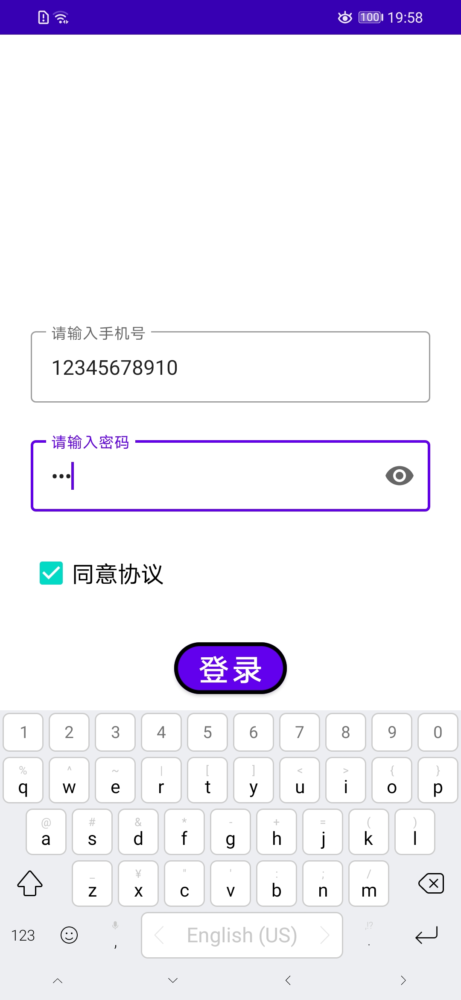
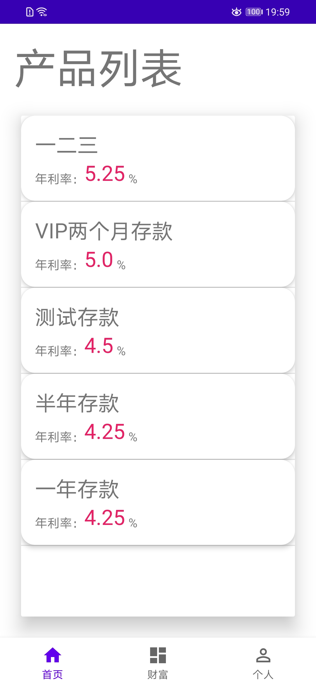
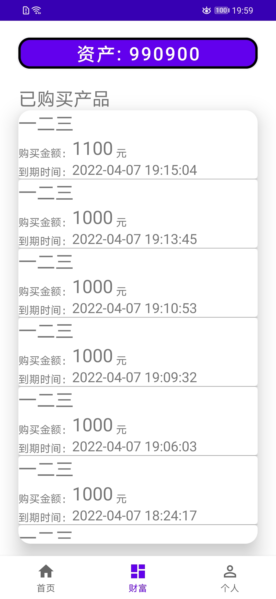
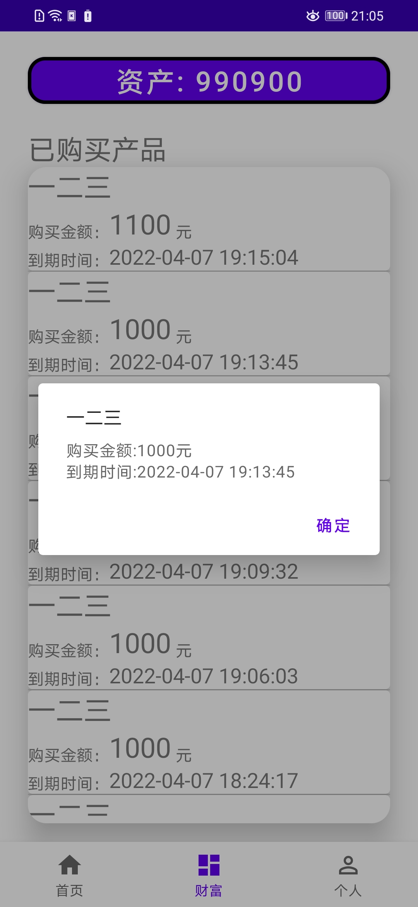
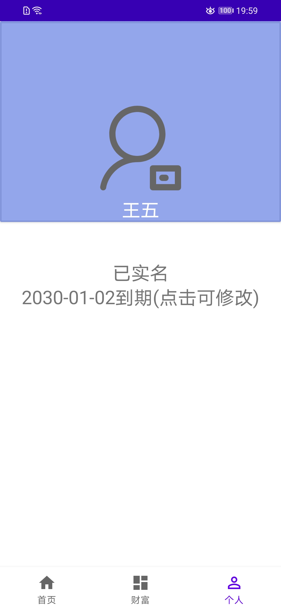
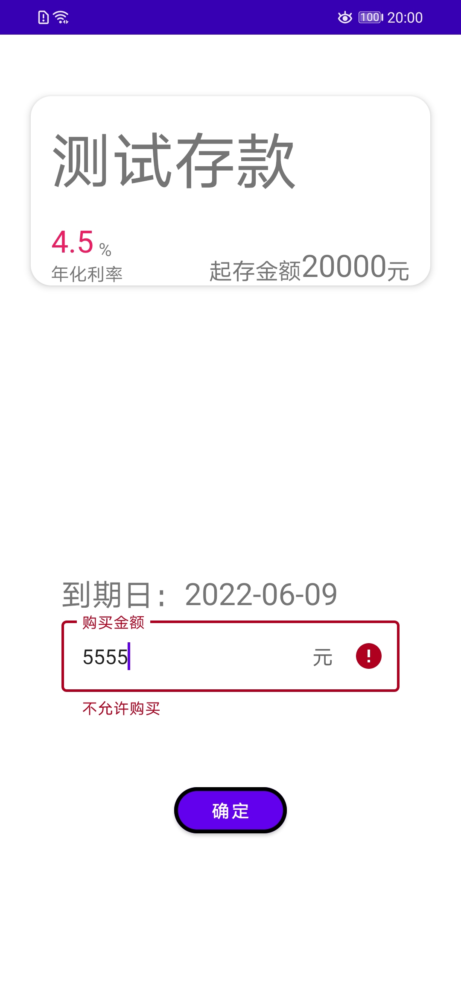
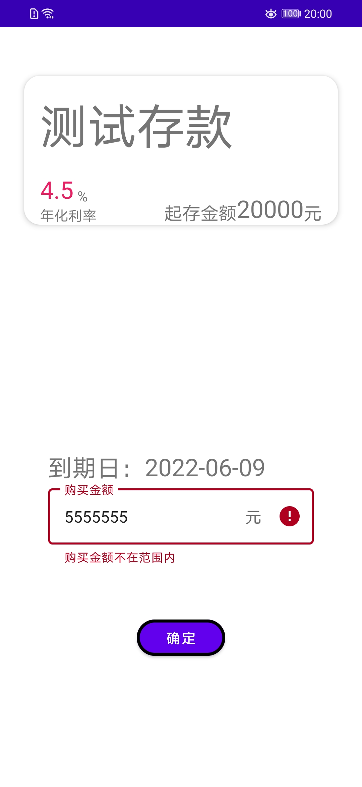

直接用 Android Studio 跑就行

如果需要查看日志 请设置 `L.kt` 中 的`level`为`Level.Error`

## preview

界面预览图

### 登录

### 主页/产品页

### 财富/资产页

### 个人信息页

### 购买页

## todo

- [x] UI重构
- [x] serviceJson 解析
  - [x] 本人验证(功能已完成)
- [x] 购买测试
- [x] 添加icon `drawable-v24/app64.png` 被ignore了